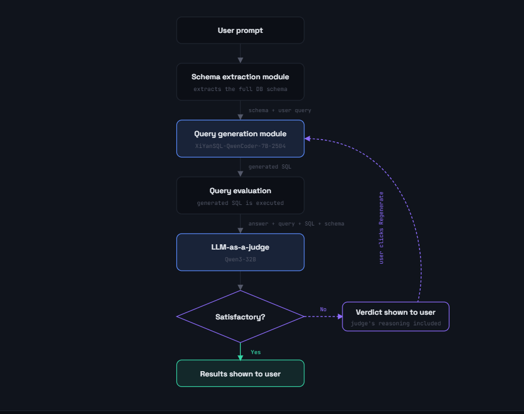

# Text-to-SQL Engine with LLM-as-a-Judge

Ask questions about a PostgreSQL database in plain English. The app turns your question into a SQL query, runs it, explains its reasoning, and then uses a second LLM to grade whether the generated SQL actually answers your question.

---

## Features

- **Natural language to SQL**: converts a plain-English question into a PostgreSQL query.
- **Automatic schema discovery**: reads table and column names straight from the database, so no hand-written schema is needed.
- **Model fallback**: tries `XiYanSQL-QwenCoder-32B-2504` first and falls back to `Qwen2.5-Coder-32B-Instruct` if it fails.
- **Query execution**: runs the generated SQL and returns the rows.
- **Reasoning output**: the model explains which tables, columns, joins and filters it chose.
- **Safe refusal**: if the question cannot be answered from the schema (or is ambiguous), the model returns `-- CANNOT_ANSWER` with an explanation instead of guessing.
- **LLM-as-a-Judge**: a separate reasoning model (`DeepSeek-V4-Pro-0813`) scores the query and gives a `PASS` / `FAIL` verdict.
- **REST API + web frontend**: built with FastAPI, with static frontend files served from the same app.

---

## How It Works



*System architecture: the user's prompt goes through schema extraction, SQL generation, execution and the LLM judge. If the verdict is unsatisfactory, the judge's reasoning is shown and the user can regenerate.*

1. **Schema extraction** (`schema_extraction_module.py`): queries `information_schema.columns` for the `public` schema and formats it as text (`Table: ... / Columns: - name: type`).
2. **SQL generation** (`TextToSQLEngine.py`): builds a strict prompt (use only schema columns, explicit JOINs, PostgreSQL syntax, `LIMIT` only when asked) and asks the model to reply with JSON containing `query` and `reasoning`.
3. **Response parsing**: strips any `</think>` reasoning block, keeps the text between the first `{` and last `}`, and parses it as JSON (with a Python-dict fallback for single-quoted output).
4. **Execution**: the SQL is run against the database and the rows are returned.
5. **Judging** (`llm_as_a_Judge.py`): the question, schema, SQL and results are sent to a judge model, which returns structured scores. The judge call is retried once if the response cannot be parsed.

---

## Judge Scoring

Each criterion is scored **0 = Incorrect, 1 = Partially correct, 2 = Correct**, with a written reason:

| Criterion | What it checks |
|---|---|
| `sql_validity` | Is the SQL syntactically valid and executable against the schema? |
| `schema_correctness` | Does it use real tables/columns and join them correctly? |
| `semantic_correctness` | Does it match the user's intent (filters, aggregation, sorting, grouping)? |
| `overall_correctness` | Overall, is it a correct answer to the question? |

The judge also returns a `final_verdict` of `PASS` or `FAIL`.

---

## Project Structure

```
.
├── main.py                      # FastAPI app and API endpoints
├── TextToSQLEngine.py           # SQL generation, parsing, execution, pipeline
├── schema_extraction_module.py  # DB connection and schema extraction
├── llm_as_a_Judge.py            # Judge LLM prompt, parsing and retries
├── requirements.txt             # Python dependencies
├── .env                         # Secrets (not committed)
├── docs/
│   └── images/
│       └── architecture.png     # Architecture diagram used in this README
└── frontend/                    # Static web UI served at "/"
```

---

## Tech Stack

- **Backend**: Python, FastAPI, Uvicorn, Pydantic
- **Database**: PostgreSQL (accessed with `psycopg2`)
- **LLMs**: Hugging Face Inference Endpoints through `langchain-huggingface`
  - SQL generation: `XGenerationLab/XiYanSQL-QwenCoder-32B-2504`, fallback `Qwen/Qwen2.5-Coder-32B-Instruct`
  - Judge: `deepseek-ai/DeepSeek-V4-Pro-0813`
- **Config**: `python-dotenv`

---

## Getting Started

### Prerequisites

- Python 3.10+
- A PostgreSQL database (the project was built against a Supabase-hosted instance)
- A Hugging Face API token with access to the models above

### Installation

```bash
git clone <your-repo-url>
cd <your-repo-folder>

python -m venv venv
source venv/bin/activate      # Windows: venv\Scripts\activate

pip install -r requirements.txt
```

### Environment Variables

Create a `.env` file in the project root:

```env
HUGGINGFACE_API_KEY=your_huggingface_token
database_password=your_database_password
URLPART1=postgresql://<user>:
URLPART2=@<host>:5432/postgres
```

The connection string is assembled as `URLPART1 + url_encoded(database_password) + URLPART2`, so the password can safely contain special characters.

### Run the App

```bash
uvicorn main:app --reload
```

Then open `http://127.0.0.1:8000` for the frontend, or `http://127.0.0.1:8000/docs` for the interactive API docs.

---

## API Reference

### `POST /generate_sql_query`

Generates and executes SQL for a question. Results are stored server-side for the other endpoints.

**Request**
```json
{ "query": "select the total number of customers" }
```

**Response**
```json
{
  "generated_sql_query": "SELECT COUNT(*) FROM customers;",
  "error": null
}
```

`error` is set when generation fails, the question cannot be answered from the schema, or query execution fails.

### `GET /get_reasoning`

Returns the model's explanation for the most recent query.

```json
{ "reasoning": "The customers table holds one row per customer, so COUNT(*) gives the total." }
```

### `GET /get_results`

Returns the rows produced by the most recent query.

```json
{ "results": [[1000]] }
```

### `GET /get_judgement`

Runs the judge LLM on the most recent query and returns the scores.

```json
{
  "sql_validity_score": 2,
  "sql_validity_reason": "...",
  "schema_correctness_score": 2,
  "schema_correctness_reason": "...",
  "semantic_correctness_score": 2,
  "semantic_correctness_reason": "...",
  "overall_correctness_score": 2,
  "overall_correctness_reason": "...",
  "final_verdict": "PASS"
}
```

Errors: `400` if no query has been generated yet (or the last one failed), `502` if the judge LLM fails.

---

## Example Schema

The judge module's test block uses a banking dataset:

| Table | Purpose |
|---|---|
| `customers` | Customer profile (name, email, phone, city, state, registration date) |
| `credit_card_transactions` | Credit card spend, card network/type, status, credit limit |
| `debit_card_transactions` | Debit card spend, account type, transaction type |
| `upi_transactions` | UPI payments, app used, status, transaction type |

Example questions you could ask:

- "How many customers do we have?"
- "What is the total amount spent per card network on credit cards?"
- "Which customers in Maharashtra made UPI transactions above 10,000?"

---

## Known Limitations and Future Work

- **Single shared state**: the latest result is kept in one global variable, so concurrent users overwrite each other. Use per-session storage or return a query ID.
- **No SQL safety layer**: generated SQL is executed as-is. Use a read-only database user and validate that only `SELECT` statements run.
- **Open CORS**: `allow_origins=["*"]` is convenient for development; restrict it in production.
- **Row limits**: results are fetched in full with `fetchall()`, so large result sets can be slow.
- **Judge pipeline**: the standalone `judgement_pipeline()` in `llm_as_a_Judge.py` is commented out and needs updating for the current `TTSQL_pipeline(user_query)` signature.
- **Evaluation**: add a benchmark set of questions with expected SQL to measure accuracy over time.

---
